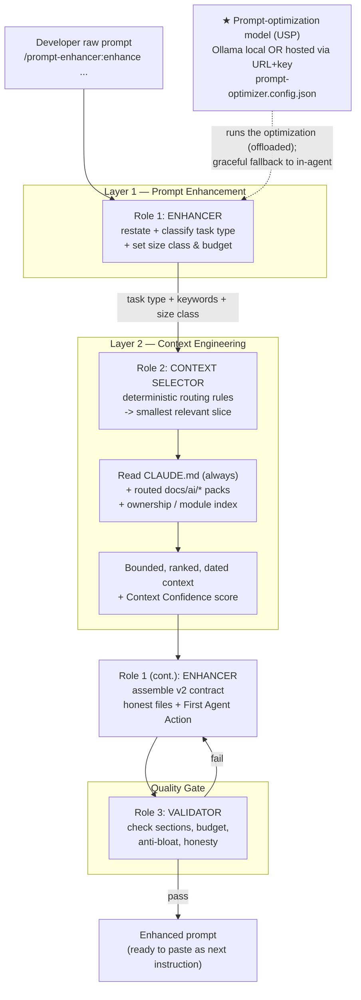
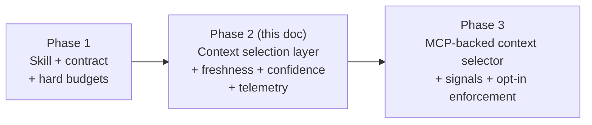

# Team Prompt Enhancer Plugin for Claude Code — v2 (Production-Ready)

> **Status**: v2.0 — production specification, supersedes [prompt-enhacer-claude-code.md](prompt-enhacer-claude-code.md)
> **Supersedes**: v1 design + integrates every point from [prompt-enhacer-claude-code-solution-review.md](prompt-enhacer-claude-code-solution-review.md)
> **Audience**: Your development team (builders, reviewers, and the platform/DevEx owner of this plugin)

> **Purpose**: Ship a team-shared Claude Code plugin that turns a vague developer request into a **structured, repo-aware, token-budgeted execution prompt**, so Claude's first response lands closer to team expectations and burns fewer tokens on ambiguity. v2 upgrades the v1 "prompt normalization layer" into a **two-layer system**: a *prompt enhancer* that structures the ask, and a *context selector* that supplies only the smallest relevant slice of repository knowledge — backed by hard size budgets, freshness rules, confidence signals, and real before/after measurement.

> ### ★ Headline capability (USP): bring your own prompt-optimization model
>
> Run the prompt-optimization step on **a model you choose** — a local model served by **[Ollama](https://ollama.com)** for zero-cost, fully private optimization, or **any hosted OpenAI-compatible endpoint** via a model **URL + API key**. This keeps prompt-shaping compute **off your premium agent's bill**, keeps raw prompts and repo context **on your own infrastructure** when privacy matters, and avoids **vendor lock-in**. Available **now in v2**, configured per repo, secrets via environment variables only, with **automatic graceful fallback** to in-agent enhancement if the provider is unavailable. See [§3.5](#35-bring-your-own-optimization-model-ollama-or-hosted) and [§9.9](#99-prompt-optimization-model-provider-ollama-and-hosted).

This design is aligned with Claude Code's plugin and skill model: plugins are self-contained, versionable, team-shareable directories, and plugin skills become namespaced commands such as `/prompt-enhancer:enhance`. Claude Code supports lifecycle hooks (`SessionStart`, `UserPromptSubmit`, `InstructionsLoaded`), which makes light enforcement and workflow nudging a good fit. [\[plugins README\]](https://github.com/anthropics/claude-code/blob/main/plugins/README.md), [\[slash commands\]](https://github.com/gregpriday/claude-code-docs/blob/main/claude-code-slash-commands.md), [\[plugins reference\]](https://code.claude.com/docs/en/plugins-reference)

---

## Table of Contents

> ★ **Headline USP** — [Bring your own prompt-optimization model (Ollama or hosted)](#35-bring-your-own-optimization-model-ollama-or-hosted) · provider config in [§9.9](#99-prompt-optimization-model-provider-ollama-and-hosted)

1. [What changed in v2 (review → response map)](#1-what-changed-in-v2-review--response-map)
2. [Honest value proposition and scope](#2-honest-value-proposition-and-scope)
3. [Solution architecture: two layers, three roles](#3-solution-architecture-two-layers-three-roles)
4. [The v2 output contract](#4-the-v2-output-contract)
5. [Task-type mini-contracts](#5-task-type-mini-contracts)
6. [Size policy and token budgets (anti-bloat)](#6-size-policy-and-token-budgets-anti-bloat)
7. [The context engineering system](#7-the-context-engineering-system)
8. [Repository layout (plugin + context packs)](#8-repository-layout-plugin--context-packs)
9. [Implementation spec and ready-to-paste file contents](#9-implementation-spec-and-ready-to-paste-file-contents)
10. [Adoption and enforcement strategy](#10-adoption-and-enforcement-strategy)
11. [Measurement and telemetry (hard metrics)](#11-measurement-and-telemetry-hard-metrics)
12. [Testing and QA (golden set + bad-behavior tests)](#12-testing-and-qa-golden-set--bad-behavior-tests)
13. [Versioning and maintenance](#13-versioning-and-maintenance)
14. [Phased rollout roadmap (v1 → v2 → v3 MCP)](#14-phased-rollout-roadmap-v1--v2--v3-mcp)
15. [Porting to GitHub Copilot](#15-porting-to-github-copilot)
16. [Final recommendation](#16-final-recommendation)
17. [Appendix A: ready-to-paste build prompt](#appendix-a-ready-to-paste-build-prompt)
18. [Appendix B: manual acceptance checklist](#appendix-b-manual-acceptance-checklist)

---

## 1) What changed in v2 (review → response map)

The review's verdict was: *"promising, useful, not magic. Treat it as a prompt quality layer first, and only later as the foundation for a real context engineering system."* v2 takes that seriously. Every gap and improvement is addressed below with a concrete, shipped change — not a roadmap note.

| #   | Review finding (gap / improvement)                                                      | v2 response                                                                                                                                         | Section                                                                                                                                           |
| --- | --------------------------------------------------------------------------------------- | --------------------------------------------------------------------------------------------------------------------------------------------------- | ------------------------------------------------------------------------------------------------------------------------------------------------- |
| G1  | Enhancer itself costs tokens; net savings are not automatic                             | Honest, measured value claim + hard token budgets on every output + before/after telemetry                                                          | [§2](#2-honest-value-proposition-and-scope), [§6](#6-size-policy-and-token-budgets-anti-bloat), [§11](#11-measurement-and-telemetry-hard-metrics) |
| G2  | "Prepared repo context" under-specified; no retrieval mechanism                         | Dedicated **context selection layer** with deterministic routing rules, ranking, and bounded size                                                   | [§3](#3-solution-architecture-two-layers-three-roles), [§7](#7-the-context-engineering-system)                                                    |
| G3  | Won't fix all high-token causes (poor module boundaries, stale docs, repeated scanning) | Scope is stated honestly; the *addressable* causes (module maps, lean facts, anti-bloat, adoption) are engineered in                                | [§2](#2-honest-value-proposition-and-scope), [§7](#7-the-context-engineering-system), [§10](#10-adoption-and-enforcement-strategy)                |
| G4  | v1 = prompt normalization; v2 should be context selection                               | Architecture is explicitly **two layers**; context selection is a first-class component                                                             | [§3](#3-solution-architecture-two-layers-three-roles)                                                                                             |
| G5  | Enhanced prompt may become verbose                                                      | Size classes (small/medium/large) with word + token caps and an explicit anti-bloat rule                                                            | [§6](#6-size-policy-and-token-budgets-anti-bloat)                                                                                                 |
| G6  | Depends too much on developer discipline                                                | Non-blocking nudges, short-prompt detection, onboarding, PR template, adoption tracking                                                             | [§10](#10-adoption-and-enforcement-strategy)                                                                                                      |
| G7  | Test plan is subjective                                                                 | Hard, countable metrics + golden set that also asserts **bad-behavior absence**                                                                     | [§11](#11-measurement-and-telemetry-hard-metrics), [§12](#12-testing-and-qa-golden-set--bad-behavior-tests)                                       |
| I1  | Add a token budget to the contract                                                      | `Prompt Size Target` + `Max Context Budget` in the contract meta block                                                                              | [§4](#4-the-v2-output-contract), [§6](#6-size-policy-and-token-budgets-anti-bloat)                                                                |
| I2  | Separate enhancement from retrieval                                                     | Three roles: **Enhancer**, **Context Selector**, **Validator**                                                                                      | [§3](#3-solution-architecture-two-layers-three-roles)                                                                                             |
| I3  | Task-type-specific mini-contracts                                                       | Mini-contracts for bugfix / feature / refactor / test / analysis                                                                                    | [§5](#5-task-type-mini-contracts)                                                                                                                 |
| I4  | Add an anti-bloat rule                                                                  | Explicit rule + validator enforcement                                                                                                               | [§6](#6-size-policy-and-token-budgets-anti-bloat), [§12](#12-testing-and-qa-golden-set--bad-behavior-tests)                                       |
| I5  | Context freshness policy                                                                | Dated + confidence-tagged context packs, refresh cadence, drift detection, source-wins rule                                                         | [§7](#7-the-context-engineering-system)                                                                                                           |
| I6  | Confidence in the output                                                                | `Context Confidence: high \| medium \| low` drives discovery vs. speed                                                                              | [§4](#4-the-v2-output-contract), [§7](#7-the-context-engineering-system)                                                                          |
| I7  | Don't over-rely on hooks                                                                | Hooks are secondary, nudge-only; the skill + context pack carry the value                                                                           | [§9.6](#96-hooks-secondary-nudge-only), [§10](#10-adoption-and-enforcement-strategy)                                                              |
| I8  | Golden tests for bad behavior                                                           | Anti-pattern assertions (hallucinated files, over-questioning, bloat, wrong task type)                                                              | [§12](#12-testing-and-qa-golden-set--bad-behavior-tests)                                                                                          |
| I9  | Honest "Relevant Files / Modules"                                                       | Never invent paths; emit a discovery action when unknown                                                                                            | [§4](#4-the-v2-output-contract), [§5](#5-task-type-mini-contracts)                                                                                |
| I10 | "Next action" mode                                                                      | `First Agent Action` section seeds disciplined discovery                                                                                            | [§4](#4-the-v2-output-contract)                                                                                                                   |
| R   | v2 roadmap items (MCP, signals, telemetry, variants)                                    | Folded into the design as concrete phases, not vague "later"                                                                                        | [§14](#14-phased-rollout-roadmap-v1--v2--v3-mcp)                                                                                                  |
| U1  | **New capability (USP)**: bring-your-own prompt-optimization model                      | Run optimization on **local Ollama** or a **hosted OpenAI-compatible endpoint (URL + key)**; cost / privacy / no lock-in; auto fallback to in-agent | [§3.5](#35-bring-your-own-optimization-model-ollama-or-hosted), [§9.9](#99-prompt-optimization-model-provider-ollama-and-hosted)                  |

---

## 2) Honest value proposition and scope

The review's most important correction: **do not over-claim**. v2 adopts a precise claim.

### What this plugin does

> It reduces token waste caused by **ambiguity** and standardizes the **first turn** of a coding task. It does **not** automatically reduce total token use unless context retrieval is disciplined and measured — which is exactly why v2 adds a context selection layer, hard budgets, and before/after telemetry.

### Where it reliably helps

- Vague requests that would otherwise trigger multiple clarification/exploration turns.
- Developers who omit acceptance criteria, constraints, and validation steps.
- Tasks that follow established repo patterns Claude should reuse rather than reinvent.
- Standardizing quality across a team so outcomes are predictable and reviewable.
- Teams that want to **offload the optimization step to a self-hosted/local model** (Ollama) or a cheaper hosted endpoint, keeping premium-agent tokens for implementation (see [§3.5](#35-bring-your-own-optimization-model-ollama-or-hosted)).

### What it will *not* fix by itself (stated plainly)

- Large repos with poor module boundaries.
- Stale or oversized `CLAUDE.md` / context packs (mitigated by the freshness policy, not eliminated).
- Agents repeatedly scanning files because the codebase lacks a module/ownership map (mitigated by `module-index.md` + `ownership.md`).
- Genuinely broad asks like "improve the app."
- Teams that never invoke the enhancer (mitigated by nudges + adoption tracking, not forced).

### The net-savings condition

The enhancer adds one upfront turn. It only pays for itself when the enhanced prompt prevents **more** exploration than it costs to produce. v2 makes this measurable (see [§11](#11-measurement-and-telemetry-hard-metrics)) and protects the upside with strict size budgets so the enhancement itself stays cheap.

---

## 3) Solution architecture: two layers, three roles

v1 asked a single skill to do everything (classify, retrieve context, structure, validate). The review correctly flagged this as fragile because the model may over-include context. v2 **separates concerns** into three roles across two layers.



### Role 1 — Enhancer (Layer 1)
Structures the ask. Restates the request precisely, classifies the task type, picks the size class, and assembles the final contract. Owns the *shape* of the output.

### Role 2 — Context Selector (Layer 2)
Chooses the **smallest useful slice** of repository knowledge using deterministic routing rules (task type + keyword → specific context files). Owns *what facts go in* and the **confidence** score. In v1 this is markdown rules + an optional script; in v3 it becomes MCP-backed (see [§14](#14-phased-rollout-roadmap-v1--v2--v3-mcp)).

### Role 3 — Validator (Quality Gate)
Checks the assembled prompt against the contract, size budget, anti-bloat rule, and honesty rules (no hallucinated files, Open Questions only if blocking). Owns *quality control*. If it fails, the Enhancer revises before emitting.

> **Why separation matters**: it lets you test, measure, and evolve each role independently. You can swap the Context Selector for an MCP server later without touching the contract or the Validator. It also prevents the single-skill failure mode where the model quietly over-includes context.

### 3.5) Bring your own optimization model (Ollama or hosted)

> **★ Unique selling point.** The prompt-optimization work — the Enhancer's restating/classification and the assembly of the contract — does **not** have to run on your premium coding agent. v2 lets each team **point the optimization step at a model they choose**: a local model served by **Ollama**, or **any hosted OpenAI-compatible endpoint** via a model URL + API key. This is available **now in v2**, not a future phase.

#### Two supported modes

| Mode                | Endpoint                                        | Auth                | Best for                                                                               |
| ------------------- | ----------------------------------------------- | ------------------- | -------------------------------------------------------------------------------------- |
| **Local Ollama**    | `http://localhost:11434/v1` (OpenAI-compatible) | none                | Zero marginal cost, full privacy — raw prompt + repo context never leave the machine   |
| **Hosted / remote** | any OpenAI-compatible base URL you provide      | API key via env var | A shared team endpoint, a self-hosted vLLM/LM Studio/TGI server, or a managed provider |

Because both modes speak the **OpenAI-compatible `/v1/chat/completions` API**, a single client covers local Ollama, self-hosted servers (vLLM, LM Studio, TGI), and managed endpoints (Azure OpenAI, OpenRouter, Together, Groq, etc.). Ollama also exposes a native `/api/chat`, supported as a secondary option.

#### Why this is a differentiator

- **Cost shift**: optimization tokens are spent on a cheap/free local or commodity hosted model, so your premium agent spends tokens only on implementation. This directly amplifies the token-savings thesis from [§2](#2-honest-value-proposition-and-scope).
- **Privacy / compliance**: with local Ollama, the *optimization step* (prompt shaping and contract assembly) runs entirely on the developer's machine — the raw prompt and context packs are not sent to any remote service during that step. Note: the Validator role always runs in Claude Code (the Anthropic-hosted model), so the final validation pass does leave the machine. Teams in regulated environments should confirm this partial-privacy model meets their requirements before citing it as full local execution.
- **No lock-in**: bring any OpenAI-compatible model; switch providers by changing one config field or one env var.
- **Consistency**: a small model dedicated to the contract produces stable, predictable structure.

#### How it plugs in (and never breaks the flow)

1. The skill reads `prompt-optimizer.config.json` (and env overrides).
2. If a provider is **enabled and reachable**, generation of the structured prompt is delegated to it via `scripts/optimize-prompt.mjs`, seeded with the routed context ([§7](#7-the-context-engineering-system)) and the contract template ([§4](#4-the-v2-output-contract)).
3. The **Validator (Role 3) still runs in-agent** on whatever the provider returns, so quality/honesty/budget rules are enforced regardless of backend.
4. If the provider is **disabled, misconfigured, or unreachable**, the skill **falls back to in-agent enhancement automatically** — the feature is strictly additive and never a single point of failure.

Configuration, schema, examples, and security rules are in [§9.9](#99-prompt-optimization-model-provider-ollama-and-hosted).

---

## 4) The v2 output contract

The contract stays **stable and ordered** (the review praised this), but v2 adds a **meta block** (size target, context budget, confidence), a **First Agent Action** section (next-action mode), and tightens the honesty rules for files.

````markdown
---
Prompt Size Target: small | medium | large
Max Context Budget: ~500 | ~1000 | ~2000 tokens
Context Confidence: high | medium | low
Task Type: bugfix | feature | refactor | test | analysis
---

# Objective
<One-sentence, implementation-oriented objective.>

# Task Type
<bugfix | feature | refactor | test | analysis> — <one line on why.>

# Repository Context
<ONLY facts needed to implement. No generic best practices.
Each fact should trace to a context pack or CLAUDE.md. Omit if none.>

# Relevant Files / Modules
<Real paths ONLY if known from the module/ownership index or prior search.
If unknown, write exactly:
"Not yet identified — see First Agent Action." Never invent paths.>

# First Agent Action
<The single best first move to ground the work — usually a targeted search
or file inspection. Always present when files are "Not yet identified".>

# Constraints and Guardrails
- follow existing pattern in <named pattern/file>
- do not change <named contract/API/schema>
- preserve backward compatibility for <consumer>

# Assumptions
- <explicit assumption to confirm; mark missing build/test/lint commands here>

# Expected Deliverables
- code changes
- tests
- docs / migration note / config update (only if needed)

# Acceptance Criteria
1. <observable, testable outcome>
2. ...

# Validation Steps
- build: <repo command or "ASSUMPTION: confirm build command">
- test: <repo command or scoped test path>
- lint/format: <repo command>
- manual verification: <what to check>

# Non-goals
- <explicitly out of scope>

# Open Questions
<Only if genuinely blocking. Otherwise omit this section entirely.>
````

### Contract rules (enforced by the Validator)

- **Meta block is mandatory.** All four meta fields must be present and consistent with the body.
- **Honesty over completeness.** `Relevant Files / Modules` must never contain invented paths. Unknown → the literal "Not yet identified" string + a `First Agent Action`.
- **`Open Questions` is omitted unless blocking.** A non-blocking unknown becomes a one-line `Assumption` instead.
- **No generic filler.** Every bullet must carry repo-specific signal or be removed (see anti-bloat, [§6](#6-size-policy-and-token-budgets-anti-bloat)).
- **`Repository Context` is implementation-only.** No architecture tour; only facts the implementer needs now.
- **Confidence drives behavior.** `low` confidence instructs the downstream agent to discover before editing; `high` lets it move faster (see [§7](#7-the-context-engineering-system)).

---

## 5) Task-type mini-contracts

The universal contract is the base. Each task type **emphasizes** different sections (review improvement I3). The Enhancer applies the matching emphasis after classification.

### Bugfix
- **Emphasize**: reproduction steps, suspected failure area, **regression test** that fails before / passes after, backward compatibility.
- **First Agent Action** default: locate the failing path and its existing tests before editing.
- **Non-goals**: unrelated refactors; behavior changes beyond the fix.

### Feature
- **Emphasize**: user-visible behavior, API/data-model impact, acceptance criteria, rollout/flagging if relevant.
- **First Agent Action** default: find the closest existing feature of the same shape and mirror its structure.
- **Non-goals**: scope creep into adjacent features.

### Refactor
- **Emphasize**: **behavior preservation**, existing test coverage as the safety net, explicit non-goals, no public contract changes unless stated.
- **First Agent Action** default: confirm current behavior is covered by tests; if not, characterize it first.
- **Non-goals**: functional changes; API surface changes.

### Test
- **Emphasize**: missing scenarios, failure paths, boundaries/edge cases, fixtures, reliability/flakiness.
- **First Agent Action** default: inventory current coverage and identify the gap.
- **Non-goals**: production code changes unless strictly required to make code testable.

### Analysis
- **Emphasize**: the specific question, the evidence needed, the deliverable format (findings doc, options table, risk list). Usually **no code changes**.
- **First Agent Action** default: identify the authoritative sources (code, ADRs, telemetry) for the question.
- **Non-goals**: implementing changes before the analysis is accepted.

> The mini-contracts live in `skills/enhance/task-contracts.md` and are referenced by the main skill so the base contract stays compact.

---

## 6) Size policy and token budgets (anti-bloat)

The review's sharpest practical warning: the enhancer can become a **prompt beautifier** that produces long, structured-looking prompts with little signal. v2 enforces hard budgets.

### Size classes

| Class      | When                                                  | Target words | Max context budget | Notes                                                                       |
| ---------- | ----------------------------------------------------- | ------------ | ------------------ | --------------------------------------------------------------------------- |
| **small**  | single-file bugfix, tiny tweak, focused test          | 150–400      | ~500 tokens        | Omit optional sections aggressively. `Open Questions` almost never present. |
| **medium** | multi-file change within one module, standard feature | 400–800      | ~1000 tokens       | Default class.                                                              |
| **large**  | cross-module change, migration, risky refactor        | 800–1400     | ~2000 tokens       | Requires a one-line justification in the meta reasoning; never the default. |

The Enhancer picks the class from the classified task and complexity signals; the Validator rejects outputs that exceed the word/token cap for their class.

### The anti-bloat rule (verbatim, enforced)

> If a section has no useful repo-specific content, write **one** concise assumption or **omit** the optional section. Do not fill sections with generic advice. Generic best-practice bullets are only allowed when tied to a named repo pattern, file, or constraint.

### Mandatory vs. optional sections

- **Mandatory**: meta block, Objective, Task Type, Acceptance Criteria, Validation Steps.
- **Conditionally mandatory**: `First Agent Action` (required when files are "Not yet identified"); `Relevant Files / Modules` (always present, may be the "Not yet identified" line).
- **Optional (omit when empty)**: Repository Context, Constraints, Assumptions, Expected Deliverables extras, Non-goals, Open Questions.

### Budgeting also protects net savings

Because the enhancement is capped, its upfront token cost is bounded and predictable, which keeps the net-savings condition from [§2](#2-honest-value-proposition-and-scope) achievable.

---

## 7) The context engineering system

This is the heart of v2 and the largest upgrade over v1. The review: *"prepared repo context is doing most of the real work, but the proposal under-specifies how that context is created, maintained, ranked, and kept small."* v2 specifies it.

### 7.1 Context pack layout

A small, curated set of markdown packs lives in the **target repository** (Mode B from v1, standardized):

```text
docs/ai/
├── repo-map.md              # high-level module/service map (what lives where)
├── module-index.md          # module -> directories, entry points, owners
├── ownership.md             # area -> team/owner (CODEOWNERS-style, human-readable)
├── commands.md              # build / test / lint / format / run commands
├── testing-strategy.md      # frameworks, layers, where tests live, how to run a subset
├── architecture-decisions.md# condensed ADR index (decision + link)
├── risk-register.md         # fragile areas, known hot spots, do-not-touch zones
└── patterns/
    ├── api.md               # how endpoints/routes/controllers are structured
    ├── workers.md           # jobs/schedulers/consumers: retries, idempotency, acks
    ├── auth.md              # authn/authz, token handling, error mapping
    └── persistence.md       # data access, migrations, transactions
```

Keep packs **small and curated** (2–4 KB each is plenty). Big dumps reintroduce the token tax the plugin is meant to avoid.

### 7.2 Deterministic context routing rules

The Context Selector maps **task type + keywords** to a minimal file set. `CLAUDE.md` is always read; everything else is routed. Default rule table (lives in `skills/enhance/context-routing.md`):

| Trigger keywords (in raw prompt)                           | Inferred area | Context files to load (besides `CLAUDE.md`)                                                                 |
| ---------------------------------------------------------- | ------------- | ----------------------------------------------------------------------------------------------------------- |
| job, worker, scheduler, cron, consumer, queue, sync        | workers       | `repo-map`, `commands`, `testing-strategy`, `patterns/workers.md`, `risk-register` (if reliability touched) |
| endpoint, route, controller, api, handler, REST, GraphQL   | api           | `repo-map`, `commands`, `testing-strategy`, `patterns/api.md`                                               |
| auth, login, token, session, oauth, permission, role       | auth          | `repo-map`, `commands`, `patterns/auth.md`, `architecture-decisions` (auth entries)                         |
| db, query, migration, schema, repository, transaction, ORM | persistence   | `repo-map`, `commands`, `testing-strategy`, `patterns/persistence.md`                                       |
| test, coverage, spec, fixture, flaky                       | testing       | `testing-strategy`, `patterns/<area>` (by secondary keyword), `commands`                                    |
| (no match)                                                 | unknown       | `repo-map`, `commands` only; lower confidence; rely on `First Agent Action`                                 |

**Rules of engagement:**
- Load the **union** for multiple matches, but cap total at the size class's `Max Context Budget`; if over budget, keep higher-ranked packs (rank order: `module-index`/`ownership` > area `patterns/*` > `testing-strategy`/`commands` > `repo-map` > `architecture-decisions`/`risk-register`).
- Never load an area pack the prompt didn't trigger **unless** the developer named that module.
- Prefer `module-index.md` + `ownership.md` to resolve real file paths instead of guessing.

### 7.3 Confidence scoring

The Context Selector emits `Context Confidence` to the meta block:

| Confidence | Condition                                                                                                      | Effect on downstream agent                                              |
| ---------- | -------------------------------------------------------------------------------------------------------------- | ----------------------------------------------------------------------- |
| **high**   | Task type matched a routing rule **and** `module-index`/`ownership` resolved concrete files for the named area | Move faster; minimal discovery; files listed honestly                   |
| **medium** | Task type matched but files not resolved, **or** packs are stale (> refresh cadence)                           | Do a brief targeted discovery (the `First Agent Action`) before editing |
| **low**    | No routing match, or only `CLAUDE.md` exists, or packs missing/empty                                           | Discover before editing; treat all repo facts as assumptions            |

This directly implements review improvement I6 and ties confidence to behavior (discover vs. speed).

### 7.4 Freshness policy (anti-staleness)

Each pack carries a small header so staleness is detectable:

```markdown
<!-- ai-context
updated: 2026-06-01
confidence: high        # author's confidence this still matches the code
owner: platform-team
-->
```

**Cadence and rules:**
- Update `module-index.md` and `ownership.md` whenever module boundaries or owners change.
- Update `commands.md` whenever package scripts / build tooling change.
- Review all packs **monthly** or **per major release**, whichever comes first.
- A pack older than the cadence is treated as **medium confidence at best** by the Context Selector.
- **Source-wins rule**: if a pack disagrees with the code the agent reads, the **code is authoritative**; the agent should flag the drift so the pack gets fixed.

### 7.5 Drift detection (lightweight, optional)

A CI job (`scripts/check-context-freshness.mjs`, [§9.7](#97-context-freshness-check-cigit-hook)) fails or warns when:
- any `docs/ai/*` pack's `updated:` date is older than N days, or
- `commands.md` references scripts not present in `package.json` (or the repo's task runner), or
- `module-index.md` lists directories that no longer exist.

This keeps the context system honest without a heavyweight index.

---

## 8) Repository layout (plugin + context packs)

### 8.1 The plugin (this repo / shared plugin repo)

```text
prompt-enhancer/
├── .claude-plugin/
│   └── plugin.json
├── skills/
│   └── enhance/
│       ├── SKILL.md                 # Role 1 orchestrator (enhancer)
│       ├── prompt-contract.md       # the v2 contract + meta block rules
│       ├── task-contracts.md        # per-task-type emphasis (bugfix/feature/...)
│       ├── context-routing.md       # Role 2 routing rules + ranking + budgets
│       ├── validator.md             # Role 3 checklist (quality gate)
│       ├── examples.md              # vague -> enhanced, good vs bad
│       └── scripts/
│           ├── select-context.mjs   # optional deterministic selector helper
│           └── count-tokens.mjs     # optional budget/token estimator
├── prompt-optimizer.config.json     # ★ USP: choose optimization model (Ollama/hosted)
├── hooks/
│   └── hooks.json                   # SessionStart + UserPromptSubmit nudges (non-blocking)
├── docs/
│   ├── README.md
│   ├── TEST_PLAN.md
│   ├── TROUBLESHOOTING.md
│   ├── METRICS.md                   # measurement schema + how to read it
│   └── ADOPTION.md                  # onboarding, PR template, rollout
├── scripts/
│   ├── optimize-prompt.mjs          # ★ USP: run optimization on Ollama/hosted model
│   └── check-context-freshness.mjs  # CI drift detector for target repos
├── tests/
│   ├── fixtures/                    # raw prompts + minimal repo context
│   ├── golden/                      # expected characteristics + anti-patterns
│   └── evaluation-notes.md
└── CHANGELOG.md
```

### 8.2 What each target repository provides

```text
<target-repo>/
├── CLAUDE.md                        # persistent facts/conventions (always loaded)
├── docs/ai/                         # the context packs from §7.1 (curated, small)
├── prompt-optimizer.config.json     # optional: per-repo override of the optimization model
└── .github/
    ├── pull_request_template.md      # includes the enhancer checkbox (§10)
    └── workflows/context-freshness.yml  # runs scripts/check-context-freshness.mjs
```

This layout follows Claude Code's documented plugin structure (manifest + `skills/` + optional support files + optional `hooks/hooks.json`). Skills may include supporting files alongside `SKILL.md`. [\[slash commands\]](https://github.com/gregpriday/claude-code-docs/blob/main/claude-code-slash-commands.md), [\[plugins README\]](https://github.com/anthropics/claude-code/blob/main/plugins/README.md)

---

## 9) Implementation spec and ready-to-paste file contents

This section is production-ready. Paste these files as the starting point and adjust the bracketed `<...>` values for your org.

### 9.1 `.claude-plugin/plugin.json`

```json
{
  "name": "prompt-enhancer",
  "description": "Transforms vague development requests into structured, repo-aware, token-budgeted execution prompts for Claude Code. Two layers: prompt enhancer + context selector, with a validator quality gate.",
  "version": "2.0.0",
  "author": {
    "name": "<Your Team / DevEx>",
    "email": "<devex@yourcompany.com>"
  },
  "homepage": "<internal docs URL>",
  "license": "MIT",
  "keywords": ["prompt", "context-engineering", "developer-experience", "claude-code"]
}
```

The plugin name becomes the skill namespace, so the skill is invoked as `/prompt-enhancer:enhance`. [\[slash commands\]](https://github.com/gregpriday/claude-code-docs/blob/main/claude-code-slash-commands.md)

### 9.2 `skills/enhance/SKILL.md` (Role 1 orchestrator)

````markdown
---
name: enhance
description: Turn a vague development request into a structured, repo-aware, token-budgeted execution prompt using the v2 contract. Invoke as /prompt-enhancer:enhance <raw request>.
---

# /prompt-enhancer:enhance

You convert a developer's raw, often-vague request into a single **execution-ready prompt**
that follows the v2 contract. You operate in three roles, in order: ENHANCER, then
CONTEXT SELECTOR, then VALIDATOR.

> **Note for implementers**: Claude Code does NOT automatically inject sibling files into context.
> Each support file must be explicitly linked below so Claude loads it when the skill runs.

## Support files (load all before starting)
- Contract rules and size policy: [prompt-contract.md](prompt-contract.md)
- Per-task-type emphasis: [task-contracts.md](task-contracts.md)
- Context routing rules and confidence scoring: [context-routing.md](context-routing.md)
- Validator checklist: [validator.md](validator.md)
- Before/after examples: [examples.md](examples.md)

## Optimization backend (★ USP — see §3.5 / §9.9)
Before enhancing, check `prompt-optimizer.config.json` (and env overrides):
- If a provider is enabled AND reachable, delegate generation to
  `scripts/optimize-prompt.mjs` via the **Bash tool**:
  ```
  node ${CLAUDE_SKILL_DIR}/scripts/optimize-prompt.mjs
  ```
  Seed it with the routed context and the contract template, then VALIDATE its output in-agent.
  If the script exits with a non-zero code or outputs `FALLBACK`, treat as unreachable.
- Otherwise, perform all roles in-agent (automatic fallback). Never fail the command because a
  provider is down. Never read API keys from anywhere except the configured environment variable.nt variable.

## Inputs (priority order)
1. The developer's raw request (the argument to this command).
2. The target repo's `CLAUDE.md` (always read if present).
3. Routed context packs under `docs/ai/` (see `context-routing.md`).
4. Optional changed-file / module hints if provided.

## Workflow

### Role 1 — ENHANCER
1. Restate the request in one precise sentence (the Objective).
2. Classify the Task Type: bugfix | feature | refactor | test | analysis.
   Apply the matching emphasis from `task-contracts.md`.
3. Choose the Size Target (small | medium | large) and the matching Max Context Budget
   using the policy in `prompt-contract.md`. Default to medium; justify large in one line.

### Role 2 — CONTEXT SELECTOR
4. Always read `CLAUDE.md` if present.
5. Use `context-routing.md` to map task type + keywords to the SMALLEST relevant set of
   `docs/ai/*` packs. Load the union, then trim to the Max Context Budget by rank.
6. Resolve real file paths ONLY from `module-index.md` / `ownership.md` or a prior search.
   If you cannot resolve them, do NOT guess paths.
7. Compute Context Confidence (high | medium | low) per `context-routing.md`.

### Role 1 (continued) — assemble
8. Fill the v2 contract from `prompt-contract.md`. Include the meta block.
9. If files are unknown, write the exact line "Not yet identified — see First Agent Action."
   and provide a concrete First Agent Action (a targeted search or file inspection).
10. Keep Repository Context implementation-only. No architecture tours, no generic advice.

### Role 3 — VALIDATOR
11. Run the checklist in `validator.md`. If any check fails, revise and re-check BEFORE output.
12. Enforce the size/token budget and the anti-bloat rule. Omit empty optional sections.

## Output
- Output ONLY the enhanced prompt (the contract), nothing else.
- The output must be immediately usable as the NEXT instruction to Claude.

## Degradation rules
- Only `CLAUDE.md` exists: produce a structured prompt; missing repo details become explicit
  Assumptions, not invented facts. Confidence is at most medium.
- No useful context at all: operate on the raw request alone; label all repo facts as
  Assumptions; Confidence = low; lead with a strong First Agent Action.
- Empty input: return a one-line usage message and a minimal example. Do not fabricate a task.
- Overly broad input ("improve the app"): return the most likely constrained interpretation
  OR ask at most ONE targeted clarifying question. Never fabricate a giant scope.
- Contradictory input: surface the conflict as a single Open Question or a clarified Assumption.
````

### 9.3 `skills/enhance/prompt-contract.md`

````markdown
# v2 Output Contract (authoritative)

Always emit the meta block followed by the sections, in this order. Omit OPTIONAL sections
when they would carry no repo-specific signal.

[Insert the exact contract from §4 of the design doc here, including the meta block.]

## Size policy
- small: 150–400 words, ~500 token context budget.
- medium (default): 400–800 words, ~1000 token context budget.
- large: 800–1400 words, ~2000 token context budget; include a one-line justification.

## Anti-bloat rule (enforced by the Validator)
If a section has no useful repo-specific content, write ONE concise assumption or OMIT the
optional section. No generic best-practice bullets unless tied to a named repo pattern,
file, or constraint.

## Honesty rules
- Never invent file paths. Unknown -> "Not yet identified — see First Agent Action."
- Open Questions appears ONLY if genuinely blocking; otherwise omit it.
- Validation Steps must use real repo commands or be flagged as ASSUMPTION placeholders.
````

### 9.4 `skills/enhance/task-contracts.md`

Contains the per-task emphasis from [§5](#5-task-type-mini-contracts) (bugfix / feature / refactor / test / analysis), each with: what to emphasize, the default `First Agent Action`, and typical non-goals.

### 9.5 `skills/enhance/context-routing.md`

Contains the routing table, ranking order, budget-trimming rules, and the confidence-scoring table from [§7.2](#72-deterministic-context-routing-rules)–[§7.3](#73-confidence-scoring). This is the Context Selector's authoritative spec.

### 9.6 Hooks (secondary, nudge-only)

`hooks/hooks.json` — hooks are intentionally **assistive only** in v1/v2 (review improvement I7). No silent rewriting, no blocking.

The schema is **identical to `.claude/settings.json` hooks** (copy the `hooks` object directly). The plugin-level `hooks/hooks.json` is loaded by Claude Code alongside user settings.

```json
{
  "hooks": {
    "SessionStart": [
      {
        "hooks": [
          {
            "type": "command",
            "command": "echo 'Tip: for vague coding tasks, run /prompt-enhancer:enhance <request> first.'"
          }
        ]
      }
    ],
    "UserPromptSubmit": [
      {
        "matcher": "",
        "hooks": [
          {
            "type": "command",
            "command": "node ${CLAUDE_PLUGIN_DIR}/hooks/nudge-short-prompt.mjs"
          }
        ]
      }
    ]
  }
}
```

> **Environment variable**: use `${CLAUDE_PLUGIN_DIR}` (not `CLAUDE_PLUGIN_ROOT`) to reference files bundled with the plugin — this is the variable Claude Code populates with the plugin's installation path. Verify the exact variable name against the installed Claude Code version before shipping.

`hooks/nudge-short-prompt.mjs` (illustrative): if the submitted prompt is very short and looks like a coding task, print a non-blocking suggestion to run the enhancer. It must **exit 0** and never block submission. Claude Code hooks fire on `SessionStart` and `UserPromptSubmit`; plugin hooks use the same event model as user-defined hooks. [\[plugins reference\]](https://code.claude.com/docs/en/plugins-reference), [\[hooks guide\]](https://code.claude.com/docs/en/hooks-guide)

> Keep hooks secondary. The value lives in the skill + context packs; hooks only raise awareness.

### 9.7 Context freshness check (CI/git hook)

`scripts/check-context-freshness.mjs` (for target repos) — warns or fails CI when packs are stale or drifted, implementing [§7.5](#75-drift-detection-lightweight-optional). Wire it into `.github/workflows/context-freshness.yml` on a schedule and on PRs that touch `docs/ai/**` or `package.json`.

### 9.8 Optional helper scripts

- `skills/enhance/scripts/select-context.mjs`: a deterministic implementation of the routing table for teams that prefer code over model-applied rules. Returns the file list + confidence for a given task type + keywords.
- `skills/enhance/scripts/count-tokens.mjs`: a rough token estimator the Validator can call to enforce budgets.

> These are optional. The skill works with the markdown rules alone; the scripts make routing and budgeting deterministic and testable.

### 9.9 Prompt-optimization model provider (Ollama and hosted)

This is the configuration behind the [§3.5](#35-bring-your-own-optimization-model-ollama-or-hosted) USP. It ships with the plugin and is overridable per target repo and via environment variables.

#### `prompt-optimizer.config.json` (committed — NO secrets)

```json
{
  "promptOptimizer": {
    "enabled": true,
    "provider": "ollama-local",
    "fallbackToInAgent": true,
    "maxOutputTokens": 1200,
    "providers": {
      "ollama-local": {
        "type": "openai-compatible",
        "baseUrl": "http://localhost:11434/v1",
        "model": "qwen2.5-coder:7b",
        "apiKeyEnv": null,
        "timeoutMs": 20000
      },
      "hosted": {
        "type": "openai-compatible",
        "baseUrl": "https://your-endpoint.example.com/v1",
        "model": "<your-model-name>",
        "apiKeyEnv": "PROMPT_OPTIMIZER_API_KEY",
        "timeoutMs": 20000
      }
    }
  }
}
```

- Select the active provider with the `provider` field, or override at runtime with `PROMPT_OPTIMIZER_PROVIDER`.
- Secrets are **never** stored here: `apiKeyEnv` names the environment variable that holds the key. Local Ollama needs no key (`apiKeyEnv: null`).
- `fallbackToInAgent: true` guarantees graceful degradation; `maxOutputTokens` keeps the optimizer within the size budget ([§6](#6-size-policy-and-token-budgets-anti-bloat)).

#### Environment variables

```text
PROMPT_OPTIMIZER_PROVIDER   # optional: override the active provider (ollama-local | hosted | ...)
PROMPT_OPTIMIZER_API_KEY    # required only for hosted providers that set apiKeyEnv
```

#### `scripts/optimize-prompt.mjs` responsibilities

- Read the config + env; resolve the active provider. If disabled/unreachable and `fallbackToInAgent`, exit with a signal telling the skill to enhance in-agent.
- Build an OpenAI-compatible chat request from: the raw request, the routed context ([§7.2](#72-deterministic-context-routing-rules)), the contract template ([§4](#4-the-v2-output-contract)), and the task-type emphasis ([§5](#5-task-type-mini-contracts)).
- Send the key as `Authorization: Bearer <key>` only when `apiKeyEnv` is set; enforce `timeoutMs` and `maxOutputTokens`.
- Return the contract-shaped prompt on stdout for the Validator to check.

#### Security rules (enforced)

- **Keys via env vars only** — never in the committed config or logs (OWASP: no hardcoded secrets).
- **HTTPS required for remote endpoints**; plain `http` allowed only for `localhost`/`127.0.0.1` (local Ollama).
- **Timeouts** on every request; on timeout or network error, fall back to in-agent.
- Do not send the prompt/context to any destination beyond the single configured endpoint.

#### Example: switch to a hosted model for one session (PowerShell)

```powershell
$env:PROMPT_OPTIMIZER_PROVIDER = "hosted"
$env:PROMPT_OPTIMIZER_API_KEY  = "<paste-key-in-your-shell-not-in-git>"
# then run Claude Code as usual; /prompt-enhancer:enhance now optimizes on the hosted model
```

---

## 10) Adoption and enforcement strategy

The review correctly flagged the adoption risk: people under pressure type "fix this." v2 makes the better path **effortless and visible** without blocking anyone.

### Non-blocking nudges
- `SessionStart` reminder (see [§9.6](#96-hooks-secondary-nudge-only)).
- `UserPromptSubmit` short-prompt detection: *"This looks underspecified. Run `/prompt-enhancer:enhance ...` or continue as-is."* Never blocks.

### Onboarding
- Add a 10-minute "How we prompt Claude Code" section to team onboarding using `docs/README.md` + `examples.md`.
- Ship 4–5 canonical before/after examples for your stack.

### PR template integration
Add to `.github/pull_request_template.md`:

```markdown
### AI-assisted change
- [ ] If Claude Code was used, the task started from `/prompt-enhancer:enhance` (or the prompt was already fully specified).
- [ ] `docs/ai/*` context packs were updated if module boundaries / commands changed.
```

### Adoption tracking
Track invocation rate and correlate with outcomes (see [§11](#11-measurement-and-telemetry-hard-metrics)). If adoption decays, improve examples and nudges — do **not** switch to forced blocking until the team explicitly opts in (a v3 option).

---

## 11) Measurement and telemetry (hard metrics)

The review: *"the real question is not 'is the enhanced prompt prettier?' It is: did this reduce total cost and improve first-pass correctness?"* v2 measures it.

### Per-task measurement schema

Log one row per coding task (CSV/JSON). Suggested fields:

```text
task_id
timestamp
developer
repo
enhancer_used                 # bool
task_type                     # bugfix|feature|refactor|test|analysis
prompt_size_class             # small|medium|large
context_confidence            # high|medium|low
context_files_used            # list / count
optimizer_provider            # in-agent | ollama-local | hosted
optimizer_model               # model name used for optimization
optimizer_tokens_offloaded    # tokens spent on the self-hosted/hosted optimizer (off the premium agent)
raw_prompt_tokens
enhanced_prompt_tokens
implementation_turns
total_session_tokens
clarification_questions       # count asked by the agent
files_read_before_first_edit  # count
first_impl_passed_tests       # bool
scope_correction_requested    # bool (did reviewer ask to re-scope?)
```

### Baseline and comparison
- Capture a **baseline** period (or A/B by `enhancer_used`) before broad rollout.
- Compare enhancer-on vs. enhancer-off cohorts on the same task types.

### Success thresholds (combine subjective rubric + hard metrics)
Subjective rubric (1–5, kept from v1): clarity, repo specificity, actionability, completeness, validation readiness, low need for follow-ups.

Hard targets for "this is working":
- ≥ 4/5 average on clarity, actionability, validation readiness.
- **Fewer clarification turns** vs. baseline.
- **Fewer files read before first edit** vs. baseline.
- **Higher first-impl-passed-tests rate** vs. baseline.
- **Net total-session-token reduction** on vague-prompt tasks (the real net-savings test from [§2](#2-honest-value-proposition-and-scope)).

Document all of this in `docs/METRICS.md` with a simple query/dashboard recipe (even a spreadsheet pivot is fine for v2).

---

## 12) Testing and QA (golden set + bad-behavior tests)

### Quality rubric
Score each enhanced prompt 1–5 on clarity, repo specificity, actionability, completeness, validation readiness, and (inverted) need for follow-up questions.

### Golden set (regression pack, ~20 pairs)
Each entry contains: the raw prompt, expected characteristics, and **anti-patterns to assert are absent**. Re-run whenever `SKILL.md`, support files, routing rules, or examples change — this prevents prompt drift.

### Bad-behavior assertions (review improvement I8)
The golden set must assert the output does **not**:
- invent file paths (honesty rule),
- ask more than one clarifying question for a normal task,
- include irrelevant architecture or generic best-practice filler,
- exceed the word/token budget for its size class,
- misclassify the task type,
- drop a safety constraint named in context,
- start implementing instead of producing the prompt,
- emit `Open Questions` when nothing is blocking.

### Functional tests (examples)
- B1 feature: `add retry handling to order sync job` → workers routing, retry/backoff/idempotency, regression test, validation steps.
- B2 bugfix: `fix duplicate event processing in invoice consumer` → dedupe/idempotency/ack-offset focus, regression test.
- B3 refactor: `cleanup auth service error handling` → behavior preservation + regression coverage; not a feature.
- B4 test: `improve tests for batch upload validator` → missing scenarios/boundaries; no unrelated prod changes.

### Negative tests
- C1 empty → usage message.
- C2 broad ("improve the app") → constrained interpretation or one targeted question.
- C3 contradictory ("refactor X without changing anything but also add retries") → surfaces the conflict.

### Context-handling tests
- D1 rich packs → uses repo-specific commands/modules; confidence high.
- D2 only `CLAUDE.md` → structured output, assumptions not hallucinations; confidence ≤ medium.
- D3 no useful context → works on input alone; labels assumptions; confidence low; strong First Agent Action.

### Hook tests
- E1 `SessionStart` reminder appears.
- E2 short-prompt nudge appears and **never blocks** submission.

### Optimization backend tests (★ USP)
- F1 local Ollama: with `provider: ollama-local` and Ollama running, the enhanced prompt is produced by the local model; `optimizer_provider = ollama-local` is logged.
- F2 hosted: with `provider: hosted` and `PROMPT_OPTIMIZER_API_KEY` set, the request hits the configured base URL with a Bearer key.
- F3 fallback: with the provider disabled or the endpoint unreachable, the skill enhances in-agent and still returns a valid contract (no command failure).
- F4 secret handling: no API key appears in the committed config, output, or logs; a missing required key triggers fallback, not a crash.
- F5 transport: a remote `http://` (non-localhost) endpoint is rejected; `https://` and `http://localhost` are accepted; timeouts trigger fallback.

Full procedures live in `docs/TEST_PLAN.md`.

---

## 13) Versioning and maintenance

- **Semantic versioning** in `plugin.json`:
  - patch: wording/example fixes.
  - minor: contract or context-routing improvements (backward compatible).
  - major: contract shape, command behavior, or hook behavior changes.
- Keep `CLAUDE.md` **factual, not procedural** (commands, conventions, contracts). Procedures live in the skill.
- Keep the **contract stable**; changing section names/order is a major bump.
- Maintain the **golden set** and re-run it on every change.
- Keep context packs small and **dated**; honor the freshness cadence ([§7.4](#74-freshness-policy-anti-staleness)).
- Treat `prompt-optimizer.config.json` as config, not code: **never commit API keys** (env vars only); a provider/model change is a minor bump, a default-provider change is documented in `CHANGELOG.md`.
- Record every change in `CHANGELOG.md`.

---

## 14) Phased rollout roadmap (v1 → v2 → v3 MCP)

The review's recommended evolution, made concrete:



### Phase 1 — Prompt normalization (v1 baseline)
Skill + stable contract. Add hard verbosity/token limits immediately (folded into v2).

### Phase 2 — Context engineering (this document)
- Two-layer architecture (Enhancer + Context Selector + Validator).
- `docs/ai/*` packs, deterministic routing, ranking, budgets.
- Freshness policy + drift detection + confidence scoring.
- Adoption tooling + hard-metric telemetry + bad-behavior golden tests.

### Phase 3 — MCP-backed context selector (next)
- Replace static file reads with an **MCP server** that dynamically selects the smallest relevant slice (changed files, related modules, ownership) per task. MCP is supported by Claude Code, so this swaps in behind the same contract without disrupting Layer 1. [\[plugins reference\]](https://code.claude.com/docs/en/plugins-reference)
- **Task-type detection signals**: feed changed-file hints, recent commits, and branch metadata into classification.
- **Opt-in stricter hooks**: graduate from reminders to gentle enforcement only after the team agrees and metrics justify it.
- **Specialized skill variants**: e.g. `/prompt-enhancer:enhance-tests` if a task type benefits from a tailored contract.
- **Telemetry-driven tuning**: use [§11](#11-measurement-and-telemetry-hard-metrics) data to find task types still producing weak first responses and improve routing/examples.

> Build Phase 3 **only after** Phase 2 metrics show which context signals actually matter. Don't over-engineer an MCP platform before the value is proven.

---

## 15) Porting to GitHub Copilot

The contract and context system are tool-agnostic; only packaging changes.

| Claude Code                                                                 | GitHub Copilot equivalent                                                                                                               |
| --------------------------------------------------------------------------- | --------------------------------------------------------------------------------------------------------------------------------------- |
| Plugin (`.claude-plugin/plugin.json`)                                       | Shared repo of customization files (versioned via the repo; optionally an internal extension)                                           |
| Skill `skills/enhance/SKILL.md` → `/prompt-enhancer:enhance`                | `prompt-enhancer.prompt.md` → `/prompt-enhancer` (or a `*.chatmode.md` for a persistent mode)                                           |
| `CLAUDE.md`                                                                 | `.github/copilot-instructions.md` (repo-wide, auto-applied)                                                                             |
| Support files                                                               | `*.instructions.md` with `applyTo` globs                                                                                                |
| `docs/ai/*` context packs                                                   | Same packs; reference them from instructions; optionally split into path-scoped `*.instructions.md`                                     |
| Hooks (`SessionStart`, `UserPromptSubmit`)                                  | No identical hooks — approximate with always-on instruction nudges + PR template / CI checks                                            |
| MCP server (Phase 3)                                                        | MCP is also supported by Copilot — the selector ports directly                                                                          |
| ★ Prompt-optimization model (`prompt-optimizer.config.json`, Ollama/hosted) | Same OpenAI-compatible endpoints; call from a VS Code task or an MCP tool. Copilot can also use local models, so the USP ports directly |

### Recommended Copilot layout

```text
.github/
├── copilot-instructions.md
├── instructions/
│   ├── prompt-contract.instructions.md
│   ├── task-contracts.instructions.md
│   └── context-routing.instructions.md
└── prompts/
    └── prompt-enhancer.prompt.md   # invoked as /prompt-enhancer
```

### Porting steps
1. Recreate the v2 contract (meta block + sections) verbatim in `prompt-enhancer.prompt.md`.
2. Put factual repo conventions in `copilot-instructions.md`; keep it lean (same discipline as `CLAUDE.md`).
3. Move procedural guidance + routing + examples into `*.instructions.md` with `applyTo` globs so they load only for relevant paths.
4. Keep the same `docs/ai/*` packs and routing rules; reference them from instructions.
5. Approximate hooks with a short reminder line + PR template / CI check; no silent rewriting.
6. Reuse the rubric, golden set, and hard metrics unchanged — only invocation syntax differs (`/prompt-enhancer`).
7. Plan the same MCP path for Phase 3.
8. Reuse the same `prompt-optimizer.config.json` and `optimize-prompt` logic to offload optimization to Ollama / a hosted endpoint; wire it via a VS Code task or an MCP tool since Copilot has no skill-script runner.

### Differences to account for
- No namespaced plugin command — avoid prompt-file name collisions in the repo.
- No lifecycle hooks — enforcement is softer (always-on instructions + CI).
- Distribution is via the repo (and optionally a shared extension); version files + keep a CHANGELOG.
- `copilot-instructions.md` and matching `*.instructions.md` auto-apply, so keep them small to avoid the context-budget tax.

---

## 16) Final recommendation

Ship v2 as:

- **two-layered** — prompt enhancement *and* context selection, with a validator gate;
- **budget-disciplined** — hard size classes and token caps, enforced, anti-bloat by default;
- **context-engineered** — small curated packs, deterministic routing, confidence, freshness, drift checks;
- **honest** — no invented files, accurate scope claims, assumptions over hallucinations;
- **measured** — hard before/after metrics plus a bad-behavior golden set;
- **lightly assisted** — nudge-only hooks; adoption via onboarding and PR templates, not blocking;
- **provider-flexible (USP)** — run prompt optimization on your own model via **Ollama (local, private, zero-cost)** or any **hosted OpenAI-compatible endpoint (URL + key)**, keeping premium-agent tokens for implementation, with graceful fallback to in-agent enhancement;
- **portable and future-proof** — same contract ports to Copilot and graduates to an MCP-backed selector in Phase 3.

This keeps the solution native to Claude Code's documented extension patterns, easy to share, and easy to improve incrementally — a real prompt-quality *and* context-engineering system, without over-building an MCP platform before the value is proven. [\[plugins README\]](https://github.com/anthropics/claude-code/blob/main/plugins/README.md), [\[slash commands\]](https://github.com/gregpriday/claude-code-docs/blob/main/claude-code-slash-commands.md), [\[plugins reference\]](https://code.claude.com/docs/en/plugins-reference)

---

## Appendix A: ready-to-paste build prompt

```text
Implement a Claude Code plugin named `prompt-enhancer` (v2), team-shared, with TWO layers
(prompt enhancer + context selector) and a validator quality gate.

Create:
1. `.claude-plugin/plugin.json` (name prompt-enhancer, version 2.0.0).
2. `skills/enhance/SKILL.md` invokable as `/prompt-enhancer:enhance <raw request>`,
   orchestrating three roles in order: ENHANCER, CONTEXT SELECTOR, VALIDATOR.
3. Support files:
   - `skills/enhance/prompt-contract.md`  (the v2 contract with this meta block:
        Prompt Size Target, Max Context Budget, Context Confidence, Task Type
     and these sections in order:
        Objective, Task Type, Repository Context, Relevant Files / Modules,
        First Agent Action, Constraints and Guardrails, Assumptions,
        Expected Deliverables, Acceptance Criteria, Validation Steps,
        Non-goals, Open Questions [only if blocking])
   - `skills/enhance/task-contracts.md`   (bugfix/feature/refactor/test/analysis emphasis)
   - `skills/enhance/context-routing.md`  (task type + keywords -> smallest docs/ai/* set,
        ranking, budget trimming, confidence scoring high|medium|low)
   - `skills/enhance/validator.md`        (checklist: sections present, size/token budget,
        anti-bloat, no invented files, Open Questions only if blocking)
   - `skills/enhance/examples.md`         (vague -> enhanced, good vs bad, per task type)
4. `hooks/hooks.json` with SessionStart + UserPromptSubmit nudges that NEVER block.
5. Docs: `docs/README.md`, `docs/TEST_PLAN.md`, `docs/TROUBLESHOOTING.md`,
   `docs/METRICS.md`, `docs/ADOPTION.md`.
6. `scripts/check-context-freshness.mjs` (drift detector for target repos).
7. Tests under `tests/fixtures` and `tests/golden` including BAD-BEHAVIOR assertions
   (no hallucinated files, no over-questioning, no bloat, correct task type, budget respected).
8. `prompt-optimizer.config.json` + `scripts/optimize-prompt.mjs` (★ USP): run the
   optimization on a developer-chosen model — local Ollama (OpenAI-compatible
   http://localhost:11434/v1, no key) OR a hosted endpoint (base URL + API key via env var).
   Support provider switching, per-repo override, timeouts, maxOutputTokens, and AUTOMATIC
   graceful fallback to in-agent enhancement when the provider is disabled/unreachable.

Enforce:
- Hard size classes: small (150-400 words / ~500 tok), medium (400-800 / ~1000),
  large (800-1400 / ~2000, justified). Reject outputs over budget.
- Anti-bloat: no generic advice unless tied to a named repo pattern/file/constraint.
- Honesty: never invent file paths; unknown -> "Not yet identified — see First Agent Action".
- Confidence drives behavior: low -> discover before editing; high -> move faster.
- Degrade gracefully when only CLAUDE.md exists or no context exists.
- Never hardcode API keys: the optimizer reads keys from environment variables only;
  require HTTPS for remote endpoints (allow http only for localhost); enforce request timeouts.

After implementation: verify discovery, run the functional/negative/context/hook tests,
run the golden set (including bad-behavior assertions), and document manual verification.
```

## Appendix B: manual acceptance checklist

- [ ] Plugin loads locally (`--plugin-dir`) and `/prompt-enhancer:enhance` is discoverable.
- [ ] Output always includes the meta block (size, budget, confidence, task type).
- [ ] Output respects the word/token budget for its size class.
- [ ] No invented file paths; unknown files produce a `First Agent Action`.
- [ ] `Open Questions` appears only when genuinely blocking.
- [ ] Context routing loads only the relevant `docs/ai/*` packs for the task.
- [ ] Confidence is `low` when only `CLAUDE.md` or no context exists.
- [ ] Hooks nudge but never block.
- [ ] ★ Optimization runs on the configured model: local Ollama (`http://localhost:11434/v1`, no key) works end-to-end.
- [ ] ★ Hosted provider works via base URL + API key supplied through an environment variable (no key in the committed config).
- [ ] Optimizer falls back to in-agent enhancement when the provider is disabled or unreachable.
- [ ] Remote endpoints require HTTPS; request timeouts enforced.
- [ ] Golden set passes, including all bad-behavior assertions.
- [ ] `docs/METRICS.md` baseline captured before broad rollout.
- [ ] Freshness CI check is wired into target repos touching `docs/ai/**`.

---

### References

- Claude Code — Plugins README (skills, plugin structure, context efficiency). https://github.com/anthropics/claude-code/blob/main/plugins/README.md
- Claude Code — Slash commands & local plugin development (`--plugin-dir`, namespacing, versioning). https://github.com/gregpriday/claude-code-docs/blob/main/claude-code-slash-commands.md
- Claude Code — Plugins reference (hooks model, MCP). https://code.claude.com/docs/en/plugins-reference
- Claude Code — Hooks guide (`SessionStart`, `UserPromptSubmit`, session init details). https://code.claude.com/docs/en/hooks-guide
- Community skills/commands layout reference. https://github.com/wshobson/commands
- Ollama — local model runner with an OpenAI-compatible API (`/v1/chat/completions`) and native `/api/chat`. https://github.com/ollama/ollama/blob/main/docs/openai.md
- OpenAI-compatible Chat Completions API (the shared contract for local Ollama and hosted endpoints). https://platform.openai.com/docs/api-reference/chat
